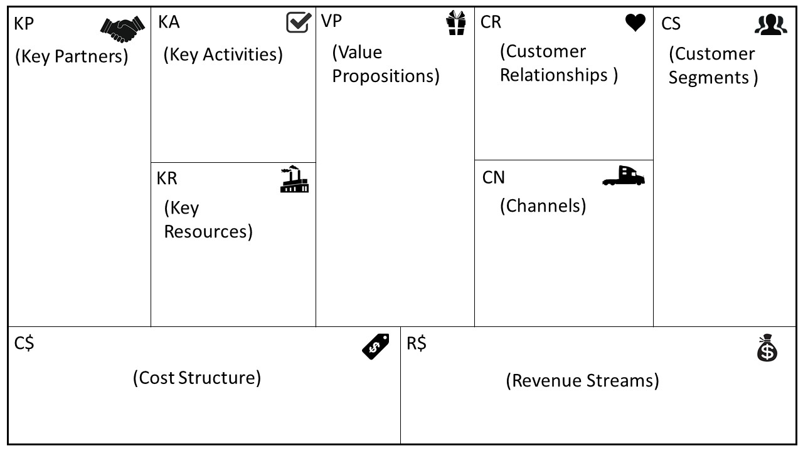
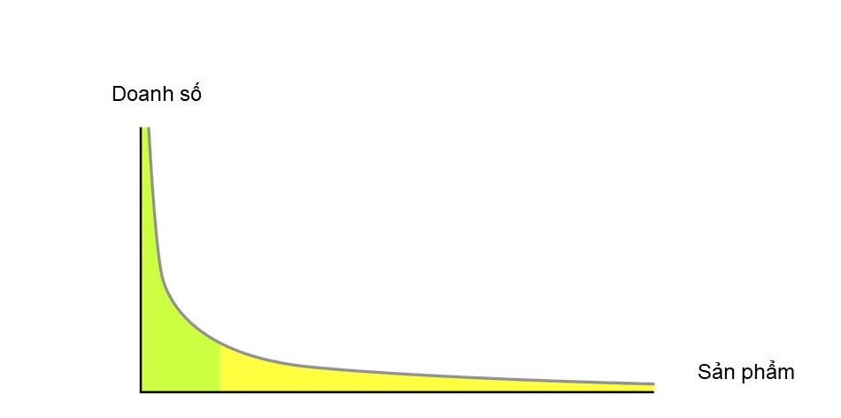
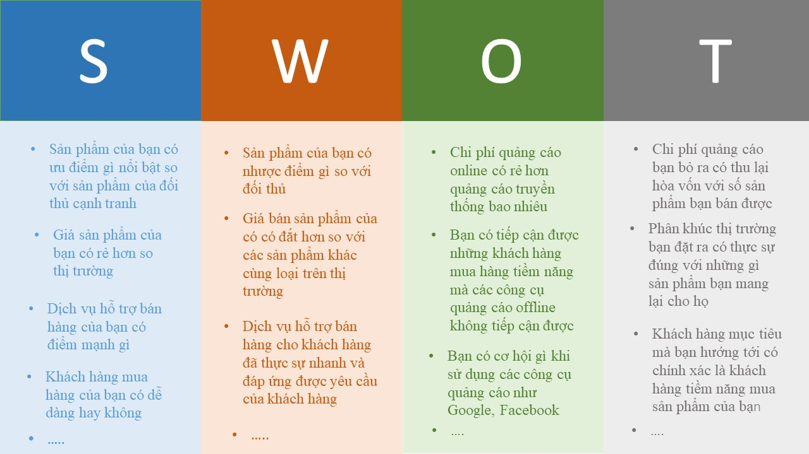

# Business Model

## Mô hình kinh doanh (Business model) là gì ? 
>Mô hình kinh doanh mô tả về cách mà một tổ chức tạo ra, phân phối và nắm bắt giá trị.

## Khung mô hình kinh doanh (Business model canvas)
- Để mô tả, hình dung, đánh giá một mô hình kinh doanh thì business model canvas (BMC) là cách tiếp cận dễ hiểu và hiệu quả.
- Business model canvas (BMC) được phát triển bởi chuyên gia quản trị người Thuỵ Điển Alexander Osterwalder. Ông đã sử dụng 9 nhóm nhân tố chính cấu thành nên BMC, ông hàm ý chúng chính là 9 trụ cột tạo nên tổ chức của một công ty.
- Business model canvas (BMC) là một cách thể hiện thông tin về các nhân tố đầu vào tạo nên chuỗi giá trị của một doanh nghiệp, được sử dụng rộng rộng rãi trong quá trình xây dựng, hoạch định một doanh nghiệp mới. Ngoài ra, thì nó cũng được sử dụng để phân tích tình hình kinh doanh hiện tại của công ty.

**1. Phân khúc khách hàng** (Customer Segments): Các nhóm người hoặc tổ chức khác nhau mà doanh nghiệp nhắm đến để tiếp cận và phục vụ. Bằng cách xác định các nhu cầu và yêu cầu cụ thể của từng nhóm khách hàng mà các sản phẩm và dịch vụ có thể được điều chỉnh để phục vụ tốt hơn cho các nhu cầu này. Điều này sẽ khiến khách hàng hài lòng hơn. Một số phân khúc có thể kể đến như:
- Thị trường đại chúng (Mass market): Không phân biệt giữa các phân khúc khách hàng khác nhau. Cố gắng phân phối, xuất tiến bán sản phẩm đến tất cả khách hàng. Phục vụ theo sở thích trung bình của toàn thị trường.
- Thị trường ngách (Niche market): Chỉ nhắm đến một nhóm khách hàng chuyên biệt với kênh pân phối chuyên biệt.
- Phân khúc thị trường (Segmented): Có sự phân biệt giữa các nhóm khách hàng. Sản phẩm được phân loại nhằm đáp ứng nhu cầu và sở thích của từng nhóm khách hàng.
- Phân khúc thị trường đa dạng (Diversified): Phục vụ 2 hoặc nhiều phân khúc khách hàng không liên quan nhau với những nhu cầu và vấn đề khác nhau.
- Thị trường hỗn hợp (Multi-sided platforms): Phục vụ một lúc từ 2 hoặc nhiều khách hàng hoạt động độc lập nhưng có liên quan trở lên.

**2. Giải pháp giá trị** (Value Propositions): Bao gồm gói sản phẩm/dịch vụ mang lại giá trị cho một phân khúc khách hàng cụ thể. 
- Để xác định giải pháp giá trị chúng ta cần phải trả lời cho câu hỏi "sản phẩm của chúng ta mang lại cho khách hàng điều gì/Giải quyết vấn đề gì cho khách hàng".
- Đây là lý do quyết định khách hàng sẽ sử dụng sản phẩm của công ty nào. 
- Giải pháp giá trị chính là một gói lợi ích mà công ty mang lại cho khách hàng đó có thể là một trong những yếu tố dưới đây:
    - Đáp ứng được yêu cầu (“Getting the job done”): Sản phẩm được thiết kế đáp ứng được yêu cầu của khách hàng để hoàn thành công việc của họ.
    - Thiết kế (Design): Thiết kế của sản phẩm phải mang tính độc đáo, khác biệt thể hiện đẳng cấp. Nó là yếu tố quan trọng nhưng khó để đo lường.
    - Thương hiệu (Brand): Nhằm đáp ứng sự thỏa mãn cảm xúc, là công cụ để thể hiện sự đẳng cấp của khách hàng.
    - Giá cả (Price): Là điều khách hàng quan tâm hàng đầu, việc cung cấp các giá trị tương đương nhưng với mức giá thấp hơn là cách phổ biến để đáp ứng nhu cầu của phân khúc khách hàng nhạy cảm về giá. Dù bình dân hay cao cấp thì giá rẻ vẫn được quan tâm cao hơn.
    - Giảm thiểu rủi ro (Risk reduction): Khách hàng luôn quan tâm đến việc giảm rủi ro phải gánh chịu sau khi mua sản phẩm hoặc dịch vụ. Vì vậy các sản phẩm có các chế độ bảo hiểm, bảo hành đi kèm luôn luôn hấp dẫn.
    - Khả năng tiếp cận (Accessibility): Làm cho việc tiếp cận sản phẩm của khách hàng trở nên dễ dàng hơn cũng là một cách tạo ra giá trị.
    - Tiện lợi/dễ sử dụng (Convenience/usability): Giúp khách hàng sử dụng sản phẩm một cách dễ dàng hơn.

 **3. Kênh phân phối** (Channel): Mô tả cách thức công ty giao tiếp và tiếp cận phân khúc khách hàng của mình để phân phối giải pháp giá trị.
- Kênh phân phối có 5 giai đoạn. Mỗi kênh có thể chứa một vài hoặc tất cả các giai đoạn. các giai đoạn bao gồm:
    - Nhận thức (Awareness): Làm sao để khách hàng biết ta là ai, mang lại giá trị gì cho họ.
    - Đánh giá (Evaluation): Giúp khách hàng đánh giá giải pháp giá trị của công ty chúng ta mang lại như thế nào.
    - Mua (Purchase): Giúp khách hàng mua hàng hoặc dịch vụ của chúng ta như thế nào.
    - Chuyển giao (Delivery): Việc chuyển giao giải pháp giá trị đến khách hàng như thế nào.
    - Hậu mãi (After sales): Dịch vụ hậu mãi như thế nào.
- Các thể loại kênh phân phối:
    - Trực tiếp: Đội ngũ nhân viên bán hàng, website bán hàng online.
    - Gián tiếp: Cửa hàng trực thuộc, cửa hàng đối tác, bán sỉ.

**4. Quan hệ khách hàng** (Customer Relationships): Mô tả các mối quan hệ mà công ty thiết lập với từng phân đoạn khách hàng cụ thể.
- Quan hệ khách hàng trong mô hình kinh doanh ảnh hưởng sâu sắc đến trải nghiệm khách hàng. Một công ty nên xác định rõ mối quan hệ mình muốn thiết lập với từng phân khúc khách hàng.
- Các mối quan hệ với khách hàng giúp công ty duy trì, mở rộng thị trường và tăng doanh số.
- Một số ví dụ về quan hệ khách hàng như:
    - Hỗ trợ cá nhân (Personal assistance): Dựa trên sự tương tác giữa con người với nhau. Khách hàng có thể liên lạc với phía đại diện bên bán hàng suốt trong quá trình mua hàng hoặc sau khi đã mua. Việc này có thể diễn ra tại địa điểm bán hàng hoặc thông qua các trung tâm chăm sóc khách hàng (thực hiện thông qua các cuộc điện thoại, email...).
    - Hỗ trợ cá nhân chuyên biệt (Dedicated personal assistance): Mỗi khách hàng sẽ có một đại diện khách hàng riêng biệt nhằm phục vụ cho khách hàng đó. Nó thể hiện mối quan hệ sâu sắc và thân mật nhất và thường phát triển trong một thời gian dài.
    - Tự phục vụ (Self-service): Công ty không duy trì mối quan hệ trực tiếp với khách hàng. Nó cung cấp tất cả các phương tiện cần thiết để khách hàng tự giúp mình. Ví dụ về điều này là các nhà cung cấp phần mềm khác nhau hướng dẫn khách hàng của họ thông qua luồng giới thiệu, thay vì cung cấp cho họ hỗ trợ cá nhân. Việc sử dụng ảnh chụp màn hình, các yếu tố thiết kế với văn bản và hướng dẫn rõ ràng có thể làm cho dịch vụ tự phục vụ thực sự dễ dàng cho khách hàng. Nếu làm đúng, nó sẽ tiết kiệm thời gian và tiền bạc cho cả khách hàng và công ty.
    - Dịch vụ tự động (Automated services): Đây là hình thức tự phục vụ tinh vi hơn với phản hồi tự động. Một ví dụ là bot trò chuyện tự động có thể giúp khách hàng truy vấn của họ khi họ đang mua hàng cũng như nhận phản hồi từ họ.
    - Cộng đồng (Communities): Cộng đồng là cách tuyệt vời để thu hút khách hàng hiện tại cũng như khách hàng tiềm năng. Đây là một trong những phương thức quan hệ khách hàng có thể được sử dụng trong suốt hành trình của khách hàng. Nhiều công ty duy trì các cộng đồng trực tuyến cho phép người dùng trao đổi kiến ​​thức và giải quyết các vấn đề của nhau.
    - Đồng sáng tạo (Co-creation): Nhiều công ty đang cố gắng vượt qua mối quan hệ nhà cung cấp - khách hàng truyền thống để đồng sáng tạo giá trị với khách hàng.

**5. Dòng doanh thu** (Revenue Streams): Là số tiền mà một công ty tạo ra được từ mỗi phân khúc khách hàng.
- Một vài cách tạo ra nguồn doanh thu: 
    - Bán sản phẩm: Doanh thu này được tạo ra bằng cách bán cho khách hàng các sản phẩm hữu hình.
    - Phí sử dụng dịch vụ: Doanh thu được tạo ra bằng cách khách hàng sử dụng một dịch vụ cụ thể. Chẳng hạn như nhà điều hành viễn thông có thể tính phí khách hàng cho số phút đã sử dụng trên điện thoại.
    - Phí thường niên (hội viên/ đăng ký): Doanh thu này được tạo bằng cách bán liên tục truy cập vào một dịch vụ. Phòng tập thể dục buộc các thành viên đăng ký hàng tháng hoặc hàng năm để đổi lấy việc truy cập vào các cơ sở tập thể dục của nó.
    - Phí thuê: Doanh thu này được tạo bằng cách tạm thời cấp cho ai đó quyền độc quyền sử dụng một nội dung cụ thể trong một khoảng thời gian cố định để đổi lấy một khoản phí.
    - Phí bản quyền: doanh thu này được tạo bằng cách cho phép khách hàng sử dụng tài sản trí tuệ được bảo vệ để đổi lấy phí cấp phép. Phổ biến trong ngành công nghiệp truyền thông, nơi chủ sở hữu nội dung giữ bản quyền trong khi bán giấy phép sử dụng cho bên thứ ba.
    - Phí hoa hồng (môi giới): doanh thu này xuất phát từ các dịch vụ trung gian được thực hiện thay mặt cho hai hoặc nhiều bên. Các công ty môi giới và bất động sản kiếm được hoa hồng mỗi khi họ kết hợp thành công với người mua và người bán.
    - Phí dịch vụ quảng cáo: doanh thu này thu được từ phí quảng cáo cho một sản phẩm, dịch vụ hoặc thương hiệu cụ thể.
- Mỗi dòng doanh thu có cơ chế giá khác nhau:
    - Giá cố định (ví dụ: giá niêm yết, phụ thuộc vào tính năng sản phẩm, phân khúc khách hàng, khối lượng sản phẩm).
    - Giá linh hoạt (ví dụ: thương lượng, đấu giá, giá phụ thuộc vào tồn kho và thời gian).

**6. Nguồn lực chính** (Key Resources): Là các yếu tố đầu vào chính mà công ty sử dụng để tạo ra giải pháp giá trị, phục vụ phân đoạn khách hàng và phân phối sản phẩm cho khách hàng. Đây là những điều quan trọng nhất để mô hình kinh doanh làm việc. 
- Các loại nguồn lực:
    - Con người: Đủ nguồn nhân lực với kiến thức, kỹ năng, thái độ và đồng bộ.
    - Tài nguyên hữu hình (Vật lý): Máy móc thiết bị, nhà xưởng, điểm bán hàng, kho bãi.
    - Tài nguyên vô hình (Tri thức): Bản quyền, thương hiệu, lợi thế kinh doanh, độc quyền kiến thức, bằng sáng chế, quan hệ đối tác và cơ sở dữ liệu khách hàng.
    - Tài chính: Nguồn cung cấp vốn, khả năng kêu gọi vốn.

**7. Các hoạt động chính** (Key activities): Mô tả những việc quan trọng nhất mà một công ty phải làm để vận hành mô hình kinh doanh của mình (Duy trì công việc kinh doanh của mình).
- Key activities có thể là những thể loại sau đây:
    - Sản xuất (Production): Những hoạt động này liên quan đến thiết kế, tạo lập và cung cấp một sản phẩm với số lượng đáng kể và / hoặc chất lượng cao.
    - Giải quyết vấn đề (Problem solving): Tạo ra những giải pháp mới cho các vấn đề riêng của từng khách hàng.
    - Nền tảng, mạng lưới kinh doanh (Platform/network): Tạo ra, duy trì và phát triển nền tảng.

**8. Các đối tác chính** (Key Partnerships): Là mạng lưới các nhà cung cấp và đối tác làm cho mô hình kinh doanh hoạt động.
- 4 loại quan hệ đối tác:
    - Strategic alliances: Liên minh chiến lược giữa các đối tác không cạnh tranh.
    - Co-opetition: Đối tác chiến lược giữa các đối thủ cạnh tranh.
    - Joint-Ventures: Liên doanh phát triển doanh nghiệp mới.
    - Buyer-Supplier Relationships: Mối quan hệ giữa người mua và nhà cung cấp để đảm bảo nguồn cung cấp đáng tin cậy.
- Có thể chia ra làm 3 động lực (lý do) để tạo ra các mối quan hệ đối tác:
    - Optimization and economy of scale: Nhằm mục đích giảm thiểu chi phí thường bao gồm quy trình sử dụng nguồn lực từ bên ngoài cũng như chia sẻ cơ sở hạ tầng.
    - Reduction of risk and uncertainty:  
    - Acquisition of particular resources and activities: Ít công ty sở hữu mọi nguồn lực hay tự thực hiện mọi hoạt động được mô tả trong mô hình kinh doanh của họ. Thay vào đó họ tập trung vào chuyên môn của mình và dựa vào các công ty khác trong việc tiến hành một số hoạt động nhất định. 

**9. Cơ cấu chi phí** (Cost structure): mô tả tất cả các chi phí phát sinh đối với vận hành một mô hình kinh doanh. Các chi phí này có thể được tính toán tương đối dễ dàng sau khi xác định các nguồn lực chính,các hoạt động chính và các đối tác chính.
- Định hướng chi phí: Tập trung vào việc giảm thiểu chi phi bất cứ khi nào có thể. Ví dụ mô hình kinh doanh vé máy bay giá rẻ của Jetstar.
- Định hướng giá trị: Ít quan tâm đến các tác động chi phí của một thiết kế mô hình kinh doanh cụ thể và thay vào đó tập trung vào việc tạo ra giá trị. Ví dụ như các khách sạn 4-5 sao.
- Cơ cấu chi phí có một số đặc trưng sau:
    - Chi phí cố định: Các chi phí không đổi tại khối lượng hàng hóa hay dịch vụ nào được sản xuất. Ví dụ như tienf thuê kho, tiền lương,...
    - Chi phí thay đổi: Các chi phí biến đổi tỷ lệ với khối lượng sản phẩm hoạc dịch vụ được sản xuất. Chi phí nguyên vật liệu, vận chuyển.
    - Tính kinh tế của quy mô: Đó là các ưu thế về chi phí mà một doanh nghiệp có được nhờ nâng cao sản lượng. Những công ty lớn là ví dụ, họ hưởng lợi từ việc mua khối lượng hàng lớn với giá thấp. Yếu tố này cùng các yếu tố khác khiến chi phí trung bình sản xuất ra một đơn vị  sản phẩm giảm khi sản lượng tăng.
    - Tính kinh tế của phạm vi: Đó là các ưu thế về chi phí mà một doanh nghiệp có được nhờ mở rộng phạm vi hoạt động. Trong một doanh nghiệp lớn, hoạt động tiếp thị hay kênh phân phối có thể sử dụng để hỗ trợ nhiều sản phẩm cùng lúc.

## Giới thiệu về mô hình kinh doanh của Facebook
**1. Phân khúc khách hàng:** 
- Người dùng internet.
- Nhà quảng cáo và tiếp thị.
- Người lập trình.

**2. Giải pháp giá trị:**
- Với khách hàng dùng Internet thì Facebook giúp họ kết nối với bạn bè, thể hiện bản thân.
- Với khách hàng là người quảng cáo thì Facebook giúp họ tìm kiếm, kết nối với khách hàng nhiều hơn cho sản phẩm dịch vụ của mình.
- Với khách hàng là những người lập trình thì Facebook giúp họ hiểu khách hàng hơn và tạo ra được nhiều sản phẩm giá trị cho khách hàng hơn.

**3. Kênh phân phối:**
- Với khách hàng thông thường thì qua website và ứng dụng điện thoại.
- Với khách hàng quảng cáo thì sẽ có một trang riêng cho quản lý quảng cáo.
- Với khách hàng lập trình thì sẽ có cái công cụ hỗ trợ lập trình riêng và API.

**4.Quan hệ khách hàng:**
- Với khách hàng dùng thông thường họ chăm sóc trên các kênh mà khách hàng đang sử dụng.
- Với khách hàng quảng cáo thì sẽ có những đơn vị là đội nhóm, đối tác hỗ trợ chăm sóc.

**5. Dòng doanh thu:**
- Với khách hàng dùng Internet thông thường thì miễn phí.
- Với khách hàng quảng cáo thì chính là ngân sách họ chạy quảng cáo.
- Phân phối application, game và các dịch vụ thu tiền trung gian khác.

**6. Nguồn lực chính:**
- Nền tảng Facebook.
- Cơ sở hạ tầng công nghệ (Server,...).

**7.Hoạt động chính:**
- Xây lên các ứng dụng nền tảng để phát triển.
- Quản lý hệ thống dữ liệu trung tâm.

**8. Đối tác chính:**
- Tất cả những người tạo ra nội dung (ca sĩ, diễn viên, truyền hình, báo chí, ...).

**9. Cấu trúc chi phí:**
- Quản lý hệ thống dữ liệu.
- Marketing và bán hàng.
- Nghiên cứu và phát triển.
- Quản trị toàn diện.

## Hình mẫu mô hình kinh doanh
>Những hình mẫu mô hình kinh doanh được mô tả dưới đây hy vọng sẽ giúp mọi người hiểu thêm về quá trình vận động của mô hình kinh doanh cũng như mang lại nguồn cảm hứng trong công việc kinh doanh.

**1. Mô hình long tail**

- Theo quy luật 80/20 của Pareto thì chỉ 20% sản phẩm đem lại 80% doanh số cho mỗi doanh nghiệp. Vì vậy, các doanh nghiệp truyền thống thường chỉ tập vào phân khúc 20% sản phẩm này. Tuy nhiên, trong thị trường kinh tế internet như hiện tại thì các doanh nghiệp vẫn có thể cải thiện doanh số của mình bằng cách áp dụng mô hình long tail.
- Các mô hình kinh doanh long tail xoay quanh việc bán nhiều sản phẩm với số lượng ít hơn thay vì bán một số ít sản phẩm nổi trội với khối lượng lớn. Các doanh nghiệp có thể tập trung chào bán nhiều sản phẩm ngách (80% sản phẩm còn lại), mỗi sản phẩm chỉ bán chạy trong một khoảng thời gian.
- Mặc dù không một loại sản phẩm nào được bán với số lượng lớn nhưng khi gộp nhiều sản phẩm lại với nhau tổng doanh số của những mặt hàng này có thể sinh lợi nhiều như mô hình truyền thống, do đó doanh thu của doanh nghiệp có thể tăng lên đến 30-40%.
- Mô hình này đòi hỏi chi phí tồn kho thấp hơn và nền tảng mạnh hơn để các sản phẩm nổi bật luôn sẵn sàng đến với những người mua ưa chuộng chúng.
- Việc xuất hiện hiện tượng long tail có 2 lý do: số hóa và internet. 
    - Công nghệ "số hoá" các sản phẩm thông tin như nhạc, phim ảnh đã giảm phí tồn trữ và phân phối của một bản nhạc, hay một DVD, xuống gần bằng con số không. Các nhà xuất bản sách, công ty phim ảnh có thể giữ trong "bộ nhớ" điện tử của họ tất cả những bản nhạc, phim ảnh, cuốn sách mà họ đã cho ra đời, không bao giờ phải hủy những tựa cũ để "dành chỗ" cho tựa mới. Do đó mà cái "đuôi" bán có thể dài bất tận.
    - Internet đã biến khâu phân phối nội dung đến khách hàng dễ dàng hơn. Các hệ khuyến nghị được áp dụng vào các website đã làm cho khách hàng có thể tiếp cận với nhiều sản phẩm tương tự hơn. Các tựa được đề nghị có thể là những quyển sách, cuốn phim, ra đời từ lâu. Thậm chí, một tác phẩm vừa ra, bán chạy, có thể gây tò mò, làm sống lại những tác phẩm ra nhiều năm trước song ít người biết khi chúng mới xuất hiện.

**2. Nền tảng đa phương**
- Các nền tảng đa phương tác hợp hai nhóm khách hàng khác biệt nhưng có quan hệ phụ thuộc qua lại. Những nền tảng này chỉ mang lại giá trị cho một nhóm khách hàng nếu có sự hiện diện của những nhóm khách hàng khác.
- Nền tảng này tạo ra giá trị bằng cách tạo điều kiện thuận lợi cho sự tương tác giữa các nhóm khách hàng.
- Chẳng hạn như Grabbike, nó là nền tảng tác hợp giữa hai nhóm khách hàng là người tài xế Grabbike (Những người có xe + nhu cầu kiếm tiền) và khách đi xe (Những người có nhu cầu di chuyển + sẵn sàng trả tiền).
- Một số ví dụ khác có thể kể đến như Google, eBay, Microsoft Window,...

**3.Mô hình kinh doanh mở**
- Mô hình kinh doanh mở là mô hình được các công ty sử dụng nhằm tạo ra và nắm giữ giá trị nhờ hợp tác có hệ thống với các đối tác bên ngoài. Điều này có thể xảy ra thông qua 2 quá trình:
    - "từ ngoài vào trong" xảy ra khi một tổ chức mang những ý tưởng, công nghệ hay tài sản trí tuệ bên ngoài ứng dụng vào quy trình phát triển và thương mại hóa của mình.
    - "từ trong ra ngoài" xảy ra khi các tổ chức cấp bằng hay bán các sản phẩm trí tuệ hoặc công nghệ đặc biệt là những tài sản không còn sử dụng nữa.
- Chẳng hạn như Innocentive cung cấp liên kết giữa các tổ chức (nơi có những vấn đề cần tháo gỡ) và các nhà nghiên cứu từ khắp nơi trên thế giới. Các công ty đăng tải những vướng mắc của mình (những người tìm kiếm) lên trang web của Innocentive. Họ trao giải thưởng từ 5.000 đến 1 triệu đô-la Mỹ cho những người tháo gỡ được vấn đề. các nà khoa học nỗ lực tìm kiếm giải pháp để giải quyết những vấn đề đó (những người giải quyết). Giải pháp giá trị của Innocentive là tổng hợp và liên kết người tìm kiếm và người giải quyết. 

## Chiến lược (Strategy)
>Chiến lược là chương trình, kế hoạch hành động được thiết kế để đạt được một mục tiêu cụ thể. Như vậy một chiến lược phải giải quyết tổng hợp các vấn đề sau:
>- Xác định chính xác mục tiêu cần đạt.
>- Xác định con đường, hay phương thức để đạt mục tiêu.
>- Và định hướng phân bổ nguồn lực để đạt được mục tiêu lựa chọn.

Sau đây giới thiệu một số chiến lược:

**1. Chiến lược mở (Open strategy)**: 
- Theo trước đây, việc xây dựng và thực hiện chiến lược thường là việc dành riêng cho CEO, hoặc một nhóm quản lý cấp cao. Các nhân viên cấp dưới không được tham gia xây dựng cũng như có ý thức trong việc thực hiện nó. 
- Tuy nhiên, trong môi trường kinh doanh phức tạp và thay đổi nhanh chóng, để xây dựng một chiến lược kinh doanh tốt là cả một thách thức to lớn cho đội ngũ CEO và quản lý. Mặc dù CEO và đội ngũ quản lý cấp cao có thể hiểu rõ về doanh nghiệp và môi trường kinh doanh nhưng họ vẫn sẽ có những điểm mù. Chẳng hạn, họ có thể không biết về các đối thủ cạnh tranh mới nổi hoặc các công nghệ đột phá mới, và ngay cả khi họ nhận thức được, họ có thể không đánh giá cao sự liên quan của họ hoặc mối đe dọa mà họ đặt ra.
- Không để nhân viên tham gia vào việc xây dụng chiến lược không chỉ là lãng phí tài năng mà còn làm cho những người tham gia thực hiện chiến lược không cảm thấy mình bất kỳ quyền sở hữu nào và có thể làm họ thiếu động lực nội tại để thực hiện chiến lược.

- Chiến lược mở là cách tiếp cận để lập kế hoạch chiến lược, nơi mà nhân viên từ tất cả các phòng ban và đơn vị kinh doanh có cơ hội đóng góp cho chiến lược tổ chức. Trong một số trường hợp, khách hàng và đối tác cũng được mời tham gia.
- Ba lý do nên áp dụng chiến lược mở:
    - Để cải thiện bản thân chiến lược.
    - Để cải thiện cách chiến lược được triển khai.
    - Để đảm bảo quyền sở hữu của nhân viên.
- Chiến lược mở không làm giảm sự quản lý của bộ máy quản lý cấp cao đối với việc phát triển và thực hiện một chiến lược. Nó chỉ là quá trình liên quan đến nhiều người và năng động hơn so với những việc họ đã làm trong quá khứ.

**2. Chiến lược thích ứng (Adaptive Strategy):**
- Chiến lược thích ứng là một cách chiến lược được đặc trưng bởi việc phát triển, cải tiến liên tục, phản ứng nhanh và thay đổi linh hoạt để làm tương quan giữa tính chất kinh tế và đặc tính xã hội. Việc xây dựng và thực hiện chiến lược không phải là các giai đoạn tuần tự riêng biệt mà đi đôi với nhau.
- Chiến lược thích ứng dựa trên triết lý và khái niệm về phát triển phần mềm nhanh nhẹn (Agile Software Development).
- Trong môi trường không thể đoán trước nhiều thay đổi, cần nhấn mạnh việc thử nghiệm liên tục và điều chỉnh theo thời gian thực hơn là phân tích và lập kế hoạch dài hạn.

## SWOT

- Đánh giá mô hình kinh doanh là việc tối quan trọng, một cách hữu hiệu để thực hiện việc đánh giá đó là kết hợp SWOT với khung mô hình kinh doanh.
- SWOT là mô hình rất nổi tiếng trong phân tích kinh doanh và định hướng marketing cho doanh nghiệp. Thông qua phân tích SWOT, doanh nghiệp sẽ nhìn rõ mục tiêu của mình cũng như các yếu tố trong và ngoài tổ chức có thể ảnh hưởng tích cực hoặc tiêu cực tới mục tiêu mà doanh nghiệp đề ra. SWOT bao gồm:
    - **Strenghts** (Điểm mạnh, ưu thế): 
        - Sản phẩm của bạn có ưu điểm gì nổi bật so với sản phẩm của đối thủ cạnh tranh? 
        - Giá sản phẩm của bạn có rẻ hơn so thị trường
        - Các kênh quảng cáo online của bạn có ưu điểm gì? 
        - Khách hàng mua hàng của bạn có dễ dàng hay không?
        - Dịch vụ hỗ trợ bán hàng của bạn có điểm mạnh gì?....
        - Một vài lĩnh vực mà bạn có thể sử dụng làm cơ sở để bạn tìm ra điểm mạnh của mình: Nguồn lực, tài sản, con người, kinh nghiệm, kiến thức, dữ liệu, tài chính, giá cả, chất lượng sản phẩm,....

    - **Weaknesses** (Điểm yếu):
        - Sản phẩm của bạn có nhược điểm gì so với đối thủ?
        - Giá bán sản phẩm của có có đắt hơn so với các sản phẩm khác cùng loại trên thị trường?
        - Kênh quảng cáo online mà bạn đang sử dụng có thực sự đang bán hàng hiệu quả?
        - Dịch vụ hỗ trợ bán hàng cho khách hàng đã thực sự nhanh và đáp ứng được yêu cầu của khách hàng?

    - **Opportunities** (Cơ hội, thời cơ):
        - Đối thủ của bạn đã biết vận dụng kênh quảng cáo online để bán hàng hiệu quả hay chưa ?
        - Bạn có cơ hội gì khi sử dụng các công cụ quảng cáo như Google, Facebook, báo điện tử …?
        - Chi phí quảng cáo online có rẻ hơn quảng cáo truyền thống bao nhiêu ?
        - Bạn có tiếp cận được những khách hàng mua hàng tiềm năng mà các công cụ quảng cáo offline không tiếp cận được ?
        - Các công cụ quảng cáo online có giúp bạn tiếp cận khách hàng mục tiêu dễ dàng và bao quát hơn không ?

    - **Threat** (Thách thức, mối đe dọa):
        - Cuộc khủng hoảng kinh tế có ảnh hưởng đến quyết định mua hàng của khách hàng khi mua sản phẩm của bạn hay không ?
        - Chi phí quảng cáo bạn bỏ ra có thu lại hòa vốn với số sản phẩm bạn bán được hay không ?
        - Khách hàng mục tiêu mà bạn hướng tới có chính xác là khách hàng tiềm năng mua sản phẩm của bạn hay không ?
        - Phân khúc thị trường bạn đặt ra có thực sự đúng với những gì sản phẩm bạn mang lại cho họ ?

## Tham khảo
- [Business Model Generation](https://gitlab.zalopay.vn/zalopay-freshers/onboarding/blob/master/books/biz/business-model-generation-a-handbook-for-visionaries,-game-changers-and-challengers.pdf)
- [Open, adaptive strategy](https://conversational-leadership.net/open-strategy/)
- [SWOT analysis](https://en.wikipedia.org/wiki/SWOT_analysis)
