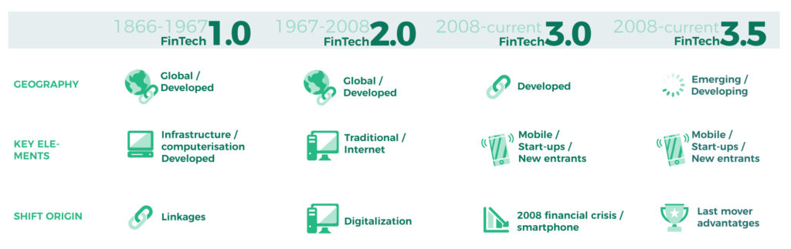

# Bài luận về Fintech

### ---Nguyễn Quốc Vương (vuongnq4)---

---------------------------------------------------------------

Fintech là từ khoá mới nổi gần đây và nhận được sự quan tâm của nhiều người, nhất là những người thuộc lĩnh vực công nghệ và tài chính. Vậy Fintech là gì, tại sao nó lại nổi bật và tiềm năng của Fintech như thế nào trong tương lai.

# 1. Khái niệm về Fintech

**Fintech** là sự kết hợp giữa Financial (tiền tệ, tài chính) và Technology (công nghệ), hiểu nôm na là công nghệ tài chính. Giải thích một cách đơn giản, thì fintech đề cập đến việc tận dụng sự sáng tạo công nghệ để sử dụng trong các hoạt động, dịch vụ tài chính. Fintech không bắt nguồn từ những hệ thống tiền tệ hiện có, mà nó đánh dấu sự xâm lấn của IT vào những hệ thống tiền tệ đó.

# 2. Quá trình phát triển của Fintech

Fintech được bắt nguồn từ đầu những năm 1990, do Citigroup khởi sướng được gọi là "Hiệp hội Công nghệ Dịch vụ Tài chính" với mục đích tạo điều kiện cho các hoạt động hợp tác về công nghệ.

- Fintech 1.0 (1866-1967) về cơ sở hạ tầng. Đây là kỷ nguyên toàn cầu hóa tài chính. Các công nghệ như điện báo, đường sắt và tàu hơi nước cho phép truyền thông tin tài chóng nhanh chóng xuyên biên giới.

- FinTech 2.0 (1967-2008) về ngân hàng. Thời kỳ chuyển đổi từ analog sang kỹ thuật số và được dẫn dắt bởi các tổ chức tài chính truyền thống. Sự ra đời của máy tính cầm tay và máy ATM đánh dấu thời kì fintech mới vào năm 1967.

- FinTech 3.0 (2008 – nay) về start-ups. Đánh dấu sự xuất hiện của một đối tượng mới bên cạnh những đối tượng đã tồn tại từ trước như ngân hàng.

# 3. Các nhóm đối tượng của Fintech

Một thị trường tài chính truyền thống sẽ bao gồm 2 đối tượng: Các định chế tài chính (ngân hàng, đầu tư, bảo hiểm, chứng khoán, công ty tài chính,...) và khách hàng.

Đối với Fintech, các đối tượng sẽ bao gồm 3 bên, giữ mối quan hệ tác động qua lại lẫn nhau:

- Các công ty Fintech: Đây là các công ty độc lập, chuyên hoạt động trong lĩnh vực công nghệ thông tin, cung cấp các sản phẩm, dịch vụ mới trong lĩnh vực tài chính. Khách hàng của các công ty Fintech có thể là người sử dụng cuối cùng và cũng có thể là các định chế tài chính.

- Các định chế tài chính: Đây là thực thể quan trọng trong ngành tài chính. Các định chế ngày càng hợp tác sâu rộng với các công ty fintech, do nhận thấy tầm quan trọng của công nghệ. Mặt khác, bản thân các định chế này cũng trực tiếp đầu tư vào các công ty fintech hoặc các hoạt động nghiên cứu, từ đó chủ động nắm giữ công nghệ mới và chiếm lĩnh thị trường.

- Khách hàng: Đối tượng khách hàng ở đây là người sử dụng sản phẩm dịch vụ tài chính nói chung.

Có thể nói rằng, với những ứng dụng công nghệ mới, thì khách hàng chính là những người hưởng lợi nhiều nhất từ sự cạnh tranh giữa các định chế tài chính, các công ty hay những tiện ích mà công nghệ mới có thể mang lại.

# 4. Các nhóm sản phẩm chính của Fintech

Các sản phẩm trong Fintech thường được chia thành 2 nhóm phân theo đối tượng sử dụng:

- Nhóm thứ nhất: các sản phẩm phục vụ người tiêu dùng, các công cụ kỹ thuật số và công nghệ khác để cải thiện cách các cá nhân vay mượn, quản lý tiền bạc, tài trợ vốn cho các startup.
- Nhóm thứ hai: các sản phẩm công nghệ "back-office" nhằm hỗ trợ cho hoạt động của các Fintech và các định chế tài chính.

Về cơ bản, ngoài những dịch vụ thông thường như thanh toán, cho vay, chuyển tiền, Fintech còn cung cấp các dịch vụ trải rộng hơn như gọi vốn cộng đồng (crowd-funding), cho vay ngang cấp (peer to peer lending), tư vấn tài chính cá nhân (Personal Finance), công nghệ bảo hiểm (Insur-Tech), tiền tệ số (Crypto Blockchain), quản trị dữ liệu (Data Management),...

# 5. Tiềm năng của Fintech

Các công nghệ mới như: trí tuệ nhân tạo (AI), phân tích và dự đoán hành vi, tiếp thị theo phân tích dữ liệu sẽ đưa ra phỏng đoán và thói quen ra khỏi các quyết định tài chính. Bởi những ứng dụng của Fintech sẽ không chỉ đơn thuần tìm hiểu thói quen của người dùng mà còn thu hút người dùng ra những quyết định chi tiêu và tiết kiệm trong vô thức tốt hơn.

# 6. Tác động của Fintech đối với ngành tài chính

- Làm thay đổi kênh phân phối và các sản phẩm dịch vụ tài chính truyền thống

- Tổ chức tài chính, ngân hàng "không giấy"

- Hỗ trợ các ứng dụng công nghệ cao

- Thị phần các ngân hàng có xu hướng giảm bớt, "nhường sân" cho các công ty fintech

- Thị trường lao động lĩnh vực tài chính-ngân hàng có sự thay đổi

# 7. Lý do gì khiến Fintech hoạt động mạnh mẽ?

Lý giải cho các hoạt động mạnh mẽ của fintech, đó là bởi fintech có khả năng tái định hình ngành tài chính song song với việc tác động mạnh mẽ đến các yếu tố được xem là quan trọng nhất của ngành này.

Hiện tại, các công ty đều cho vay theo mô hình P2P – kết nối trực tiếp người cho vay và người đi vay qua Internet, và đã cho thấy khả năng hoạt động hiệu quả, giảm tải thời gian xác nhận các khoản vay ở các ngân hàng truyền thống từ vài tuần xuống còn vài giờ.

Mặt khác, nhiều ông lớn trên thị trường tài chính cũng đang thử nghiệm việc áp dụng các đồng tiền ảo như Bitcoin, Ethereum, Ripple để thay thế các phương thức thanh toán và tài sản truyền thống.

# 8. Vai trò của Fintech trong cách mạng 4.0

- Làm thay đổi các kênh dịch vụ tài chính truyền thống: Xu thế phát triển mạnh mẽ của các kênh bán hàng qua internet, đặc biệt ở dịch vụ ngân hàng như Mobilebanking, Tablet Banking, Ngân hàng Kỹ thuật số, Internetbaking,...
- Ứng dụng công nghệ cao: Bigdata là một ví dụ cụ thể giúp phân tích hành vi của khách hàng giảm chi phí nhưng vô cùng hiệu quả, nâng cao chất lượng dịch vụ
- Thay đổi thị trường lao động lĩnh vực tài chính: Nhu cầu về nguồn nhân lực chất lượng cao sẽ gia tăng (giỏi về chuyên môn tài chính lẫn công nghệ thông tin)

# 9. Rủi ro tiềm ẩn mà Fintech có thể mang đến

Một số người nghi vấn và đặt ra nhận định rằng fintech không thể thay thế vai trò của các ngân hàng truyền thống do một số hạn chế nhất định, có thể kể đến như:

- Các hộ gia đình có thu nhập thấp không thể tiếp cận với các dịch vụ ngân hàng.

- Sự lên xuống thất thường từ cổ phiếu của các công ty fintech khiến nhiều người đặt dấu chấm hỏi về tính ổn định cũng như những rủi ro về fintech hoàn toàn là một viễn cảnh có thể xảy ra.

- Mặc dù fintech cung cấp nhiều loại hình dịch vụ tài chính, tuy nhiên, sự thuận tiện quá mức có thể khiến một số khách hàng không thực sự hiểu về các quyền hạn lẫn nghĩa vụ của bản thân.

- Nhiều vấn đề về tính an toàn, chính xác của hệ thống tài chính Fintech vẫn cần được siết chặt và đảm bảo hơn.

Tuy nhiên, tính cho đến thời điểm hiện tại thì đây vẫn được xem là một lĩnh vực tài chính an toàn, uy tín, không chỉ trên thị trường tài chính tại Việt Nam mà còn ở phạm vi thế giới.

# 10. Thực trạng áp dụng Fintech hiện nay

Hiện tại các vấn đề của Fintech chủ yếu nằm ở security, vi phạm các quy tắc tiền tệ luật pháp ở các nước. Không dễ gì lấy được license (giấy phép) để đầu tư vào lĩnh vực này. Kể cả khi lấy được license cho đến khi có thể release 1 service cũng mất ít nhất là 1 năm, điều đó là thử thách đối với các nhà đầu tư. Tuy nhiên, bên cạnh là thử thách, đây cũng là cơ hội rất lớn vì cạnh tranh trên thị trường hiện nay ở lĩnh vực này còn ít, điều đó có nghĩa là công ty nào có sự nhạy bén đón đầu được xu thế, có chiến lược service đúng đắn, cụ thể và vượt qua được những rào cản đó sẽ có thể bứt phá, chiếm lĩnh thị trường vô cùng mạnh mẽ.

Tuy nhiên, cùng với IoT, VR, Fintech cũng sẽ là 1 lĩnh vực sẽ có nhiều đột phá và sáng tạo trong tương lai.

Fintech tạo ra cơ hội cũng như thách thức đối với hệ thống ngân hàng và cùng với đó là xu hướng hình thành mối quan hệ hợp tác giữa Fintech và các ngân hàng.

Vai trò của Ngân hàng Nhà nước là rất quan trọng trong việc hoàn thiện hệ sinh thái, thúc đẩy sự phát triển và hợp tác giữa các công ty Fintech với các ngân hàng thương mại.

# 11. Xu hướng phát triển của Fintech thế giới

- Fintech sẽ ngày càng thâm nhập mạnh mẽ hơn vào các lĩnh vực dịch vụ mà ngân hàng cung cấp, trong đó bên cạnh những lĩnh vực truyền thống vốn là thế mạnh của ngân hàng là thanh toán và cho vay, Fintech sẽ tiếp tục phát triển sang những lĩnh vực có nhiều tiềm năng khác như dịch vụ chuyển tiền quốc tế, cho vay ngang hàng, gọi vốn cộng đồng,...

- Fintech sẽ tiếp tục đi đầu trong việc ứng dụng các công nghệ mới, nâng cao tiện ích cho người sử dụng cũng như mức độ bảo mật cho khách hàng. Ví dụ như, việc phát triển các công cụ tự phục vụ như Internet Banking và Mobile Banking; cung cấp các giải pháp số hóa cho ngành ngân hàng; cung cấp các giải pháp về POS thế hệ mới như POS sử dụng công nghệ giao tiếp trường gần NFC hoặc mã QR; cung cấp giải pháp công nghệ giúp tăng cường bảo mật khách hàng từ các hoạt động gian lận, làm giả tài khoản và ăn cắp thông tin; phát triển các giải pháp thanh toán ngang hàng và ví điện tử, sử dụng công nghệ phi tiếp xúc cho ví điện tử; áp dụng rộng rãi công nghệ Blockchain trong lĩnh vực tài chính – ngân hàng; sử dụng các công nghệ hiện đại và dữ liệu từ mạng xã hội để nâng cao các quyết định đầu tư...

Như vậy, có thể nhận thấy trong những xu hướng phát triển của Fintech trong thời gian tới sẽ tiếp tục chứng kiến sự thâm nhập mạnh mẽ của Fintech vào các lĩnh vực trong ngành ngân hàng. Điều này có thể tạo ra những cơ hội cũng như những thách thức đối với hệ thống ngân hàng trong quá trình phát triển dưới kỷ nguyên công nghệ 4.0.

# 12. Fintech tại Việt Nam

Cùng với tiến trình phát triển kinh tế – xã hội, hệ thống các tổ chức tín dụng đã phát triển mạnh mẽ với mạng lưới trải rộng khắp cả nước, cung cấp các dịch vụ ngày càng đa dạng cho người dân và doanh nghiệp.

Tuy nhiên, trong khi người dân ở thành thị và các doanh nghiệp lớn khá dễ dàng tiếp cận các dịch vụ ngân hàng thì những người dân ở khu vực nông thôn, vùng sâu, vùng xa, những người di cư ra thành thị cũng như các doanh nghiệp siêu nhỏ, doanh nghiệp nhỏ và vừa vẫn gặp một số trở ngại khi tiếp cận các dịch vụ ngân hàng.

# 13. Thách thức và lợi ích của các công ty khởi nghiệp Fintech

- Đội ngũ quản lý nhỏ:

    - Thách thức: Hạn chế trong việc giải quyết các task cần thiết để thực hiện các hoạt động cho vay, lỗ hổng về kỹ năng là không thể tránh.
    - Lợi ích: Công ty có thể đưa ra quyết định và thực hiện nhanh hơn.

- Hạn chế về tín dụng và kinh nghiệm khởi nghiệp:

    - Thách thức: Các công ty có thể không có sự hiểu biết rõ về các quy tắc chi phối việc mở rộng tín dụng cho người dùng từ quan điểm pháp lý.
    - Lợi ích: Có thể suy nghĩ về một vấn đề về tín dụng thông qua một cách nhìn mới mà không phải đi theo lối mòn cũ. Từ đó, có những đổi mới mang tính cách mạng.

- Nguồn tài chính eo hẹp:

    - Thách thức: Khó khăn trong việc tăng quy mô.
    - Lợi ích: Công ty có thể tập trung vào các mặt hàng quan trọng cho phép họ có được một sản phẩm khả thi tối thiểu (minimum viable product).

- Thị trường mục tiêu không xác định hoặc mô hình kinh doanh chưa phát triển:

    - Thách thức: Không có mô hình kinh doanh hiệu quả thì công ty không thể đưa sản phẩm ra thị trường. Không có thị trường xác định sẽ khó khăn trong việc xác định cơ hội cho các nhà đầu tư.
    - Lợi ích: Các công ty dễ dàng xoay quanh một khái niệm khác, mô hình kinh doanh và thị trường mục tiêu sẽ được xác định qua cơ hội hiện tại.

- Kém trong việc phân tính dữ liệu:

    - Thách thức: Sẽ thiếu sự hiểu biết về thị trường và khách hàng, không thể đưa ra kết luận có ý nghĩa từ tập dữ liệu.
    - Lợi ích: Các công ty phát triển khả năng phân tích dữ liệu của riêng họ có lẽ sẽ không phải đi theo lối cũ của các công ty dịch vụ truyền thống.

- Áp lực từ các nhà đầu tư để nhanh chóng thiết lập các hoạt động:

    - Thách thức: Có thể dẫn đến việc phải tung ra sản phẩm sớm để.
    - Lợi ích: Tăng hiệu quả và hướng đến tập trung vào sản phẩm khả thi tối thiểu.

- Thiếu kiến thức trong việc tuân thủ quy định tài chính:

    - Thách thức: Có thể gây ra nguy hiểm. Gây ra các vụ kiện tụng, tiền phạt và các chế tài từ cơ quan pháp lý.

Có thách thức cũng có cơ hội, điều quan trọng là các công ty khởi nghiệp Fintech cần việc qua thách thức và tận dụng cơ hội đang có.

# 14. Một số công nghệ trong Fintech

- Blockchain: Ngoài việc sử dụng tiền điện tử cho các giao dịch trực tuyến riêng tư và nhanh chóng, blockchain còn cung cấp một sổ cái minh bạch, an toàn, bất biến và đáng tin cậy để ghi lại các hợp đồng, giao dịch và hồ sơ.

- Big Data: Ngoài việc thu thập dữ liệu tài chính truyền thống, các nguồn dữ liệu mới như mobile banking và IoT cung cấp thêm một lớp dữ liệu thu thập được. Kết hợp với AI, Big Data sử dụng một lượng lớn dữ liệu cũ và mới để khám phá các rủi ro và phát hiện gian lận tốt hơn, giúp cải thiện sự hiểu biết về hành vi của khách hàng và giúp các ngân hàng tạo ra các sản phẩm dịch vụ tốt hơn.

- Artificial Intelligence (AI): AI giúp các ngân hàng phân tích Big Data của họ để cải thiện các giải pháp hiện có và đưa ra quyết định tốt hơn. Một chatbot AI thông minh hơn hoặc trợ lý ảo có thể đảm nhận các hoạt động có giá trị thấp, lặp đi lặp lại, như thực hiện các giao dịch số lượng nhỏ, giải thích các sản phẩm tài chính và cung cấp tư vấn tài chính cơ bản cho khách hàng.

- Regulatory Technology (RegTech): Hầu hết RegTech là services và tools sử dụng Big Data và Cloud Computing để tăng cường khả năng giám sát, báo cáo và tuân thủ các quy định của công ty. Các công ty sử dụng AI và predictive analytics để tự động hóa các nhiệm vụ cần tuân thủ, giảm gian lận, rủi ro, xác thực và quản lý danh tính.

- Biometrics: Được xem là giải pháp cứu cánh của an toàn và bảo mật dữ liệu. Chúng sử dụng tính chất sinh học duy nhất của cá nhân như vân tay, khuôn mặt, giọng nói, võng mạc và các hình thức nhận dạng khác để tăng cường bảo mật và xác định danh tính.

# 15. Một số công ty fintech nổi tiếng

- Ở Việt Nam, có thể kể ra như: Momo (ví momo), thanh toán Ngân Lượng, thanh toán Bảo Kim, Zalopay, mPOS, 1Pay, 123Pay, Payoo, VinaPay, quản lý dữ liệu tài chính cá nhân (OnePay, BankGo, MoneyLover), Mobivi,...

- Trên thế giới, có: Ant Financial/Alipay, Paytm, Credit Karma, Visa, Paypal, Stripe,...

# 16. Đôi lời cảm nhận

Cùng với sự phát triển kinh tế - xã hội ở Việt Nam, hệ thống tín dụng của ngày càng phát triển và đa dạng. Những năm gần đây, số lượng các công ty và ứng dụng Fintech xuất hiện ngày càng nhiều đem đến nhiều tiện ích cho người dân. Điển hình là việc thanh toán ví điện tử để thay đổi hoàn toàn cuộc sống, mọi việc mua bán điều không nhất thiết phải cần có tiền mặt. Nhận thấy rằng công nghệ không ngừng phát triển thì Fintech cũng sẽ có những bước tiến mạnh mẽ trong tương lai. Tuy vậy, việc Fintech xuất hiện làm công việc kinh doanh của ngân hàng trở nên khó khăn hơn rất nhiều nếu không theo kịp công nghệ. Các ngân hàng, công ty môi giới chứng khoán và những thực thể truyền thống khác cũng lo ngại rằng vì bây giờ chúng ta mới bắt đầu xây dựng luật quản lý trong khi đó các công ty fintech đang có một lợi thế lớn trong cuộc đua giành thị phần. Cùng với đó là vấn đề bảo mật của fintech khi mà Internet càng ngày càng mở rộng thì không tránh khỏi việc xuất hiện các tin tặc lợi dụnh mô hình kinh doanh tài chính công nghệ để chuộc lợi. Nhà nước cần hoàn thiện hơn cơ sở pháp lý để ràng buộc các trách nhiệm của các bên trong lĩnh vực Fintech, tạo một sân chơi lành mạnh để đất nước ngày càng phát triển. Bên cạnh đó, các ngân hàng cần tiếp thu và thích ứng với xu hướng fintech để cùng phát triển hiệu các với các doanh nghiệp fintech. Các công ty Fintech đặc biệt là các công ty khởi nghiệp trong lĩnh vực này sẽ phải đối mặt với nhiều thách thức khi mà sự cạnh tranh ngày càng cao, vấn đề pháp lý cũng như tiếp thu công nghệ mới. Hãy nhớ rằng Fintech không chỉ gói gọn trong công nghệ và còn liên quan đến thị trường tài chính và vấn đề pháp lý! Việc đáng trăn trở bây giờ là làm sao để phổ biến công nghệ và xu hướng Fintech về vùng nông thôn, nơi mà cơ sở hạ tầng chưa phát triển, người dân chưa quen tiếp xúc công nghệ, nếu làm được điều này thì tôi tin rằng cuộc sống người dân sẽ thuận tiện hơn rất nhiều.

Bản thân tôi đang làm việc tại một công ty làm về ví điện tử nhân thấy rằng thị trường ví điện tử đang phát triển rất sôi động với mức tăng trưởng thanh toán điện tử rất cao. Điều này dẫn đến sự phát triển nhanh và rất mạnh của các loại hình thương mại điện tử. Vì thế, tại Việt Nam có nhiều ví điện tử, chỉ tính tới cuối 2017 có đến 20 ví điện tử được cấp phép. Điều này dễ hiểu khi mà cơ cấu dân số trẻ, độ phủ sóng của điện thoại thông minh khá lớn cùng với sự tiện lợi và các chương trình khuyến mại hấp dẫn đang khiến ví điện tử được người dùng yêu thích và sử dụng rất nhiều. Ví điện tử cung cấp cả một hệ sinh thái gói gọn trong chiếc điện thoại thông minh đem đến sự tiện dụng cho người dùng. Phát triển sôi động là vậy nhưng thị trường ví điện tử sẽ khó mà bùng nổ được. Lý do là ví điện tử ở Việt Nam vẫn chưa thể thay thế được tiền mặt, chưa thay thế được thói quen sử dụng tiền mặt của người dân. Việc dùng một ứng dụng trên điện thoại để thanh toán khiến nhiều người lo lắng về sự bảo mật và an toàn. Không dừng lại ở lý do đó, việc tạo ra một hệ sinh thái đủ lớn để thanh toán được gần như mọi thứ trong đời sống thông qua một chiếc điện thoại di động là điều mà các ví điện tử tại Việt Nam chưa làm được. Việc mỗi loại ứng dụng ví điện tử Việt Nam hiện nay chưa có một hệ sinh thái đủ lớn để phục vụ người dùng cũng đến từ việc lượng người sử dụng tài khoản ngân hàng ở Việt Nam còn chưa cao. Để thực sự xuất hiện viễn cảnh, mọi người ra đường chỉ cần một chiếc điện thoại thông minh có thể thanh toán mọi thứ vẫn còn rất xa vời đối với nước ra. Nhưng tôi tin với sự phát triển không ngừng của nước ta cộng với những nỗ lực làm thay đổi cuộc sống của con người thì ở một tương lai gần nào đó, viễn cảnh đó rồi sẽ thành sự thật.

# 17. Kết luận

Fintech được xem là bứt phá lớn về công nghệ trong tài chính. Với những thành tựu đã đạt được và tiềm năng có thể trông thấy trong tương lai, Fintech chắc chắn sẽ còn vươn xa.
